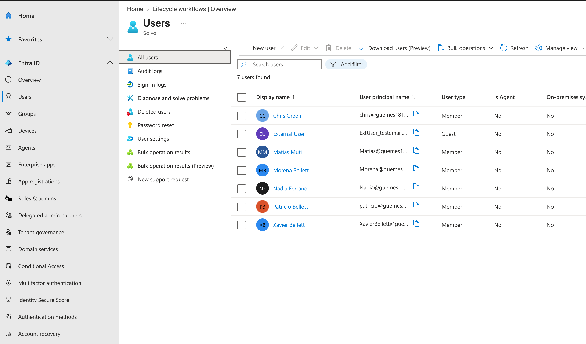

# 01 - HR-Driven Provisioning

## Objetivo
Simular cómo un sistema de HR (Workday o SuccessFactors en un escenario real) provisiona usuarios automáticamente en Microsoft Entra ID, usando un CSV como fuente de datos autoritativa.

## Contexto
En organizaciones reales, el sistema de HR es la fuente de verdad del ciclo de vida de un empleado (Joiners-Movers-Leavers). En vez de que IT cree cuentas manualmente cuando alguien entra, el dato viaja desde HR hacia el directorio de identidades. Este módulo simula esa primera etapa: los datos de HR llegando a Entra ID.

## Proceso

1. Armé un CSV con datos ficticios de empleados, incluyendo: `UserPrincipalName`, `DisplayName`, `Department`, `JobTitle`.
2. Usé la función **Bulk create** de Entra ID (Users > Bulk operations > Bulk create) para importar los usuarios desde ese CSV.
3. Verifiqué que cada usuario quedara creado con sus atributos correctos, especialmente `Department` — este atributo es la pieza clave que conecta este módulo con el siguiente (grupos dinámicos).

## Archivos en esta carpeta

- `empleados-ejemplo.csv` — el CSV usado para el bulk import.
- `screenshots/users-list.png` — usuarios ya creados en Entra ID.

## Resultado

## Aprendizajes

- El atributo `Department` es el que después usan las reglas de membership dinámica del módulo 02 — sin este dato bien cargado, nada de lo que sigue funciona.
- En un escenario real, este paso se automatiza por completo con los conectores nativos de Workday/SuccessFactors (HR-driven provisioning), sin intervención manual — acá lo simulé a mano para entender el concepto de fondo.
- Si el CSV no sigue exactamente el formato de la plantilla de bulk import de Microsoft, la carga falla o quedan campos vacíos — vale la pena descargar la plantilla oficial antes de armar el propio.
