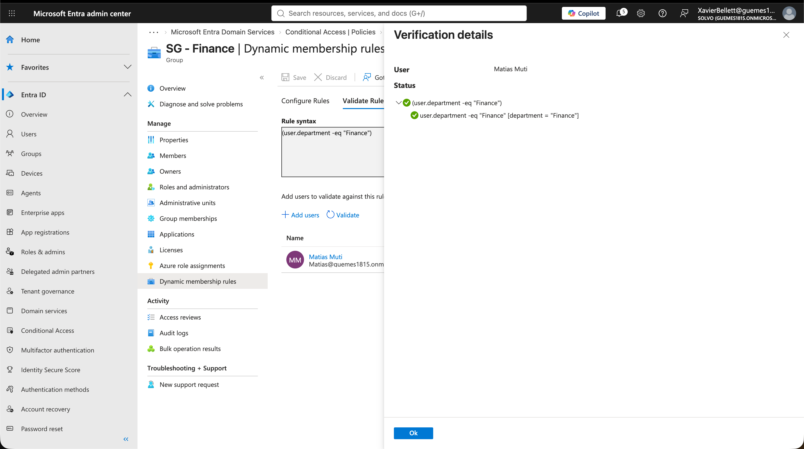

# 02 - Dynamic Groups por Departamento

## Objetivo
Agrupar automáticamente a los usuarios por departamento usando grupos dinámicos de Entra ID, de forma que la membership se actualice sola cuando cambia el atributo `Department` de un usuario (sin intervención manual).

## Contexto
Este es el corazón del escenario de "Mover" dentro del ciclo Joiner-Mover-Leaver: cuando un empleado cambia de área, su acceso técnico debería reflejar ese cambio automáticamente, sin que alguien de IT tenga que acordarse de mover a la persona de un grupo a otro a mano.

## Proceso

1. Creé un grupo de seguridad por cada departamento (`SG-Finance`, `SG-IT`, `SG-HR`, `SG-Marketing`, `SG-Sales`).
2. En cada grupo, configuré el tipo de membership como **Dynamic User** en vez de Assigned.
3. Escribí una regla de membership dinámica por grupo, por ejemplo para Finance:
   ```
   (user.department -eq "Finance")
   ```
4. Usé la pestaña **Validate Rules** para confirmar, con un usuario de prueba real, que la regla lo reconocía correctamente antes de darla por buena.
5. **Prueba de extremo a extremo**: cambié el atributo `Department` de un usuario que estaba en IT a "HR", y confirmé que Entra ID lo removió automáticamente de `SG-IT` y lo agregó a `SG-HR` sin que yo tocara la membership manualmente.

## Archivos en esta carpeta

- `screenshots/dynamic-rule-finance.png` — la regla de membership configurada para Finance.
- `screenshots/validate-rule.png` — validación de la regla contra un usuario real.
- `screenshots/mover-before-after.png` — el usuario de prueba antes y después del cambio de departamento.

## Resultado



## Aprendizajes

- El operador `Equals` en las reglas dinámicas requiere coincidencia exacta (mayúsculas/minúsculas y espacios incluidos) con el valor del atributo del usuario — un error de tipeo en el CSV original del módulo 01 puede romper esta regla silenciosamente.
- La actualización de membership dinámica no es instantánea; puede tardar unos minutos en propagarse, sobre todo la primera vez.
- Este mecanismo es la base técnica real detrás de la automatización de accesos por rol/departamento en la mayoría de las organizaciones que usan Entra ID.
