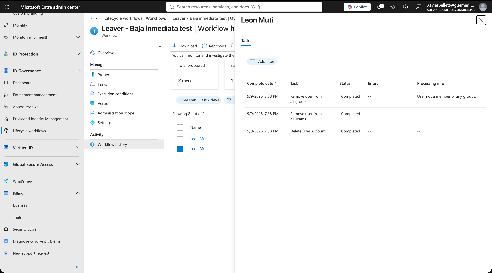

# 04 - Lifecycle Workflows: Escenario de Leaver

## Objetivo
Automatizar la baja de un empleado ("Leaver") usando Microsoft Entra ID Governance Lifecycle Workflows, de forma que al ejecutar el workflow se revoque automáticamente su acceso: remoción de grupos, remoción de Teams, y eliminación de la cuenta.

## Contexto
Este módulo cierra el ciclo completo de Joiner-Mover-Leaver que empezó en el módulo 01. Así como HR-driven provisioning automatiza el alta y los grupos dinámicos automatizan los cambios de rol, Lifecycle Workflows automatiza la baja — la parte más sensible en términos de seguridad, porque un acceso que no se revoca a tiempo es un riesgo real de seguridad.

## Prerequisito
Lifecycle Workflows requiere licencia **Microsoft Entra ID Governance** (no alcanza con P2 solo). Activé el trial gratuito de 30 días con 25 licencias desde Entra Admin Center > Billing > Trials.

## Proceso

1. Creé un usuario de prueba descartable y lo agregué a un grupo (`SG-Finance`) para tener algo real que el workflow pudiera remover.
2. En **Identity Governance > Lifecycle Workflows > New workflow**, elegí el template **"Real-time employee termination"** — a diferencia del template programado por fecha, este permite ejecución inmediata (on-demand), ideal para pruebas.
3. Configuré el nombre del workflow y dejé el scope abierto a todos los usuarios (para simplificar el lab).
4. Revisé las 3 tareas predefinidas del template: remover de todos los grupos, remover de Teams, y eliminar la cuenta.
5. Agregué al usuario de prueba en la sección "Select users" del workflow.
6. Ejecuté el workflow con **"Run on demand"**.
7. Verifiqué en el **Workflow history** que las 3 tareas se completaran correctamente, y confirmé que el usuario ya no aparecía en Active users.

## Archivos en esta carpeta

- `screenshots/workflow-template-selection.png` — elección del template de Leaver en tiempo real.
- `screenshots/workflow-run-on-demand.png` — ejecución on-demand.
- `screenshots/workflow-history-success.png` — historial con las 3 tareas completadas.

## Resultado

## Aprendizajes

- El template "Real-time employee termination" elimina la cuenta del usuario al final — hay que usar siempre un usuario descartable para pruebas, no uno que se necesite después para otros ejercicios.
- Lifecycle Workflows requiere una licencia separada (Entra ID Governance), distinta de P1/P2 — un detalle que hay que tener en cuenta al armar un lab similar desde cero.
- Automatizar la baja es tan importante como automatizar el alta: un acceso que sigue activo después de que alguien se va es una de las causas más comunes de brechas de seguridad en organizaciones reales.
