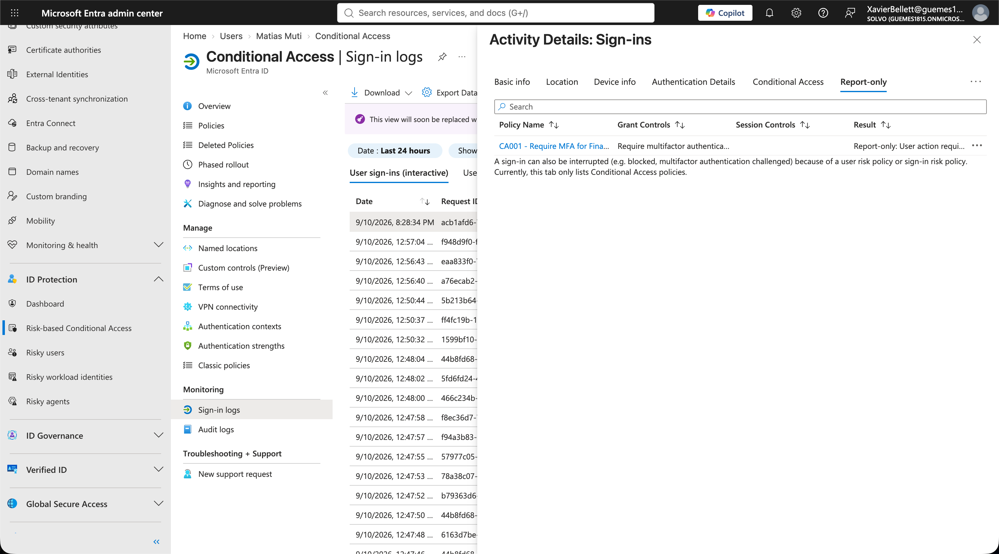

# 06 - Conditional Access: Requerir MFA para Finance

## Objetivo
Configurar una Conditional Access Policy que exija autenticación multifactor (MFA) a los usuarios del departamento de Finance, usando el grupo dinámico `SG-Finance` ya armado en el módulo 02 como scope de la policy.

## Contexto
Conditional Access es el mecanismo central de Entra ID para aplicar controles de seguridad condicionales al acceso: "si se cumple tal condición (usuario, ubicación, dispositivo, riesgo), entonces exigí tal control (MFA, dispositivo compliant, etc.)". Este módulo conecta directamente con el trabajo de los módulos anteriores — la policy se aplica sobre el mismo grupo dinámico por departamento que ya usábamos para licenciamiento, reforzando la idea de que un solo grupo puede controlar múltiples aspectos de acceso al mismo tiempo (licencias + seguridad).

## Proceso

1. En **Entra Admin Center > Protection > Conditional Access > Policies**, creé una nueva policy llamada `CA001 - Require MFA for Finance`.
2. **Users**: seleccioné específicamente el grupo `SG-Finance` como scope, en vez de aplicar la policy a todo el tenant.
3. **Target resources**: configurado para aplicar a todos los recursos/apps en la nube.
4. **Grant**: tildé "Require multifactor authentication" como control de acceso.
5. **Antes de activarla de verdad**, la dejé en modo **Report-only** — esto permite ver en los logs qué hubiera pasado sin bloquear realmente a nadie, una práctica de seguridad importante para no romper el acceso de usuarios reales por una policy mal configurada.
6. Verifiqué en **Sign-in logs > [usuario] > pestaña "Report-only"** que la policy se evaluaba correctamente, con el resultado `Report-only: User action required` — confirmando que, de estar activa, este sign-in hubiera necesitado MFA.
7. Antes de activar la policy en modo "On", verifiqué dos cosas críticas de seguridad: que mi propia cuenta admin no estuviera incluida en el scope (para no bloquearme a mí mismo), y que el único usuario dentro de `SG-Finance` (Matías Muti) tuviera un método de MFA disponible para registrar.
8. Cambié el toggle de **Report-only a On**, activando la policy de verdad.

## Archivos en esta carpeta

- `screenshots/policy-configuration.png` — configuración de la policy (scope, grant controls).
- `screenshots/report-only-result.png` — el resultado en los logs mostrando `Report-only: User action required`.

## Resultado

## Aprendizajes

- **La pestaña "Conditional Access" en el detalle de un sign-in solo muestra policies que están activas (On)** — mientras una policy está en modo Report-only, su resultado aparece en una pestaña separada llamada **"Report-only"**, no en la pestaña general. Esto generó confusión al principio porque la pestaña principal decía "Not applicable" aunque la policy sí se estaba evaluando.
- El código de error de sign-in **50055** indica que la cuenta necesita cambiar su contraseña (por ejemplo, en el primer login con una contraseña temporal) — es un tipo de interrupción distinto al de Conditional Access, y hay que saber diferenciarlos al leer los logs.
- El modo **Report-only** es una práctica de seguridad clave antes de activar cualquier policy de Conditional Access en producción: permite validar el impacto real sin arriesgarse a bloquear usuarios legítimos por un error de configuración.
- Reutilizar el mismo grupo dinámico (`SG-Finance`) tanto para licenciamiento como para Conditional Access muestra el valor real de estructurar el acceso basado en grupos desde el principio — un solo punto de control (la membership del grupo) afecta múltiples capas de acceso.
