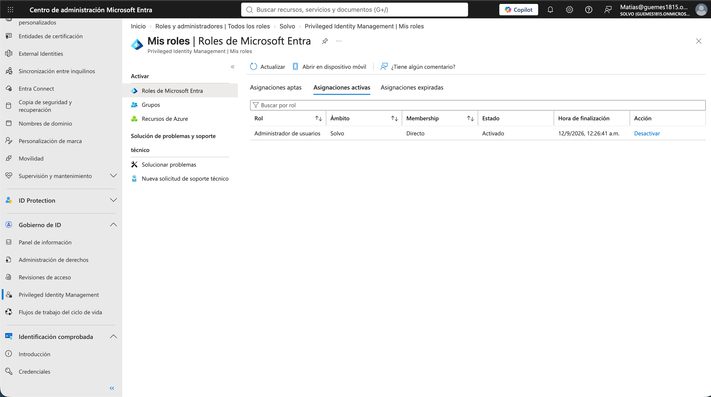

# 07 - Privileged Identity Management (PIM): Acceso Just-In-Time

## Objetivo
Configurar Privileged Identity Management para que un usuario tenga acceso al rol **User Administrator** solo cuando lo necesita y por tiempo limitado (Just-In-Time access), en vez de tenerlo asignado de forma permanente — el principio de "least privilege" aplicado a roles administrativos.

## Contexto
Uno de los mayores riesgos de seguridad en cualquier directorio es tener administradores con roles privilegiados asignados de forma permanente ("standing access"), aunque solo los usen ocasionalmente. Cuanto más tiempo una cuenta tiene privilegios elevados, mayor es la superficie de ataque si esa cuenta se ve comprometida. PIM resuelve esto separando "elegibilidad" (poder solicitar el rol) de "activación" (tenerlo realmente activo), agregando aprobación y MFA como controles adicionales en el medio.

## Proceso

1. En **PIM > Microsoft Entra roles > Roles**, seleccioné el rol **User Administrator** y entré a su configuración (Settings).
2. En la pestaña de activación, configuré dos controles:
   - **Require approval to activate**: cualquier activación del rol necesita que un aprobador (en este caso, mi propia cuenta admin) la apruebe manualmente.
   - **Require Microsoft Entra MFA**: el usuario tiene que completar MFA al momento de activar el rol, no solo al iniciar sesión.
3. En **Assignments > Add assignments**, asigné el rol User Administrator a mi usuario de prueba (Matías Muti) con tipo de asignación **Eligible** (no Active), por una duración limitada.
4. Logueado como Matías, fui a **PIM > My roles**, encontré el rol disponible como "Eligible", y solicité su activación — lo cual me pidió completar MFA y escribir una justificación.
5. Volví a mi cuenta admin, fui a **PIM > Approve requests**, y aprobé la solicitud de Matías.
6. Confirmé en la sesión de Matías que el rol pasó a estado **Active**, con el tiempo de expiración visible (8 horas) — después de ese tiempo, el rol vuelve a estado eligible automáticamente, sin que nadie tenga que revocarlo manualmente.

## Archivos en esta carpeta

- `screenshots/role-settings-approval-mfa.png` — configuración del rol exigiendo aprobación y MFA.
- `screenshots/eligible-assignment.png` — la asignación de Matías como Eligible.
- `screenshots/active-role-8-hours.png` — el rol ya activo en la sesión de Matías, con el tiempo de expiración.

## Resultado

## Aprendizajes

- Dentro de Privileged Identity Management, la sección **"My roles"** (bajo "Activate") es la vista de un usuario sobre sus propios roles, mientras que la administración de asignaciones para otros usuarios vive en una sección separada, bajo **"Manage" > "Microsoft Entra roles" > "Assignments"** — son dos pantallas distintas que comparten nombre parecido, algo que generó confusión al principio.
- El ciclo completo de PIM (Eligible → solicitud de activación → aprobación → Active con expiración automática) es la implementación práctica del principio de "least privilege": nadie tiene el poder de un rol administrativo más tiempo del estrictamente necesario.
- Este mismo patrón lo había usado antes en un contexto laboral real, dando acceso eligible por 1 semana para el re-enrollment de dispositivos — la diferencia acá es aplicarlo a un rol nativo de Entra ID (User Administrator) en vez de un rol custom, que es el escenario que más se evalúa en el examen SC-300 y en auditorías de seguridad reales.
